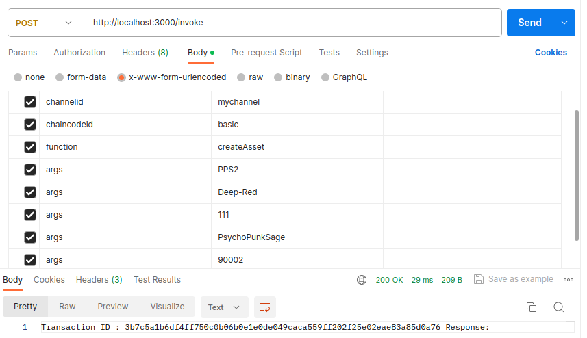
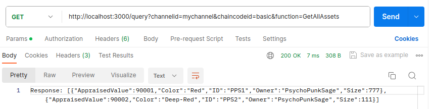
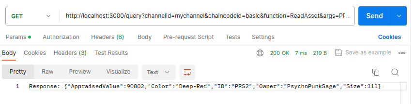

# Running Chaincode \<REST API>

## Installation

>First clone the Official Fabric sample.

```bash
git clone https://github.com/hyperledger/fabric-samples.git
cd fabric-samples
```
Go through the folders and observe the structure and filsystem.

## Task
> Implement the Chanicodes functions using REST API <br>
> **Path::** <br>
***&nbsp;&nbsp;&nbsp;&nbsp;CHAINCODE:- fabric-samples/asset-transfer-basic/chaincode-go/chaincode/smartcontract.go***<br>
***&nbsp;&nbsp;&nbsp;&nbsp;REST_API:- fabric-samples/asset-transfer-basic/rest-api-go/***


## Requirements
1. Docker/ Docker-compose
2. Docker Desktop (optional but recommended) <br>
3. **You MUST turn Network UP...** **[Reference](https://github.com/PsychoPunkSage/Vivenns/blob/Hyperledger/1_running_fabric_images/1_Direct_way.md)**

## PROCEDURE:
>> **1. Setup the Network**

> I have given a bash-script: ***network-configure.sh***<br>
- Save ***network-configure.sh*** inside **PATH:** fabric-samples/test-network
- Make ULTRA-SURE that ***network-configure.sh*** in same location as ***network.sh***

```bash
# Command
cd fabric-samples/test-network
chmod +x network-configure.sh
./network-configure.sh
```
This will setup the Fabric-network using **CRYPTO="Certificate Authorities"**

Output (on success):
```
<-- OUTPUT -->

--------------------------------------------------------------------------------
=========================== NETWORK SETUP COMPLETE =============================
--------------------------------------------------------------------------------
```

> Check whether it **Actually** worked or not...
```bash
peer chaincode query -C mychannel -n basic -c '{"Args":["GetAllAssets"]}'
```
Output (on success):
```
<-- OUTPUT -->

[{"AppraisedValue":300,"Color":"blue","ID":"asset1","Owner":"Tomoko","Size":5},{"AppraisedValue":400,"Color":"red","ID":"asset2","Owner":"Brad","Size":5},{"AppraisedValue":500,"Color":"green","ID":"asset3","Owner":"Jin Soo","Size":10},{"AppraisedValue":600,"Color":"yellow","ID":"asset4","Owner":"Max","Size":10},{"AppraisedValue":700,"Color":"black","ID":"asset5","Owner":"Adriana","Size":15},{"AppraisedValue":800,"Color":"white","ID":"asset6","Owner":"Michel","Size":15}]
```


>> **2. Use API to call the function** <br>

> Move to REST-API for golang
```bash
# Command
cd ../asset-transfer-basic/rest-api-go/
```

> Install the packages and run the API
```bash
go mod vendor
go run main.go
```

Output (on success):
```
<-- OUTPUT -->

2023/12/18 17:01:50 Initializing connection for Org1...
2023/12/18 17:01:50 Initialization complete
Listening (http://localhost:3000/)...

```

> Go through the README.md in ***rest-api-go***<br>
It contain info about How to **invoke** and How to **query** the blockchain.....

***Invoking: (createAsset)***
```bash
curl --request POST \
  --url http://localhost:3000/invoke \
  --header 'content-type: application/x-www-form-urlencoded' \
  --data = \
  --data channelid=mychannel \
  --data chaincodeid=basic \
  --data function=createAsset \
  --data args=Asset123 \
  --data args=yellow \
  --data args=54 \
  --data args=Tom \
  --data args=13005
```

***Querying: (ReadAsset)*** [Make sure you have executed above command before running this one]
```bash
curl --request GET \
  --url 'http://localhost:3000/query?channelid=mychannel&chaincodeid=basic&function=ReadAsset&args=Asset123' 
```

***Querying: (GetAllAsset)***
```bash
curl --request GET \
  --url 'http://localhost:3000/query?channelid=mychannel&chaincodeid=basic&function=GetAllAsset' 
```

> Using ***POSTMAN***

***Invoking: (CreateAsset)***


***Querying: (GetAllAsset)***


***Querying: (ReadAsset)***



>> Here You **cannot** access **"asset1 - asset6"** defined using *InitLedger* Function. <br>
Since you are querying the data **using App**. App is not able to detect the initLedger data. Only data that is made using the App is detectable.

>> **BRING DOWN THE NETWORK**
```bash
./network.sh down
```

## Resources
* [Hyperledger Fabric-Sample](https://github.com/hyperledger/fabric-samples) (Go through it)


## Contributing

Pull requests are welcome. For major changes, please open an issue first
to discuss what you would like to change.